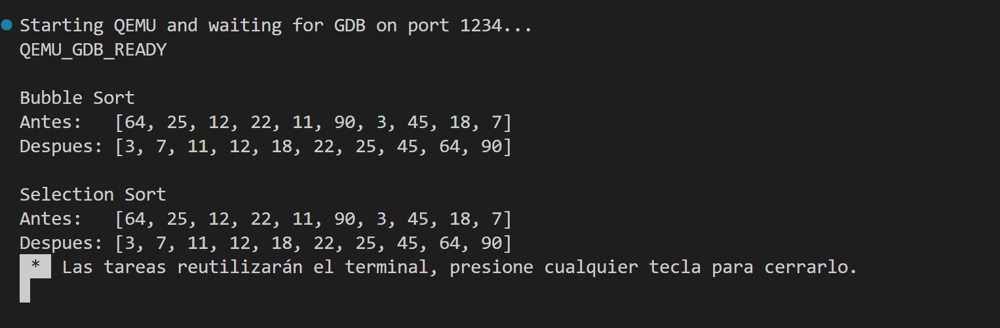
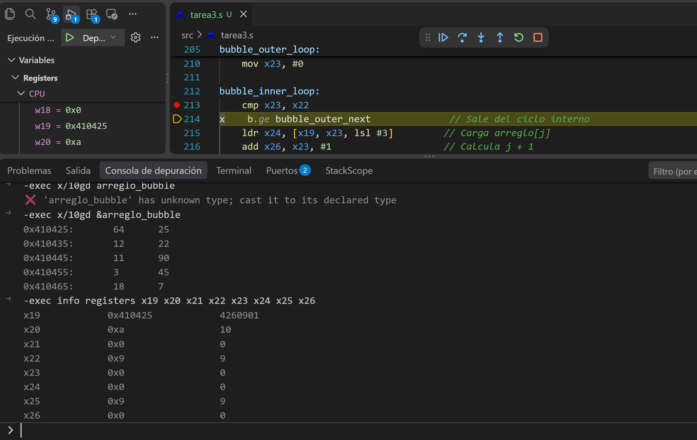
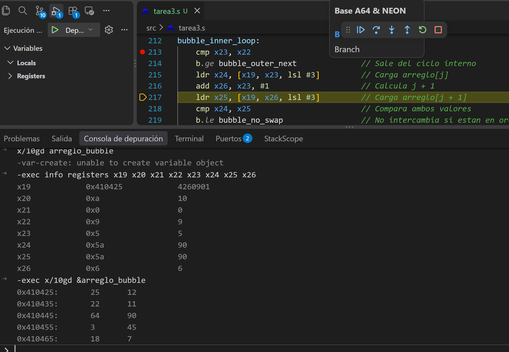
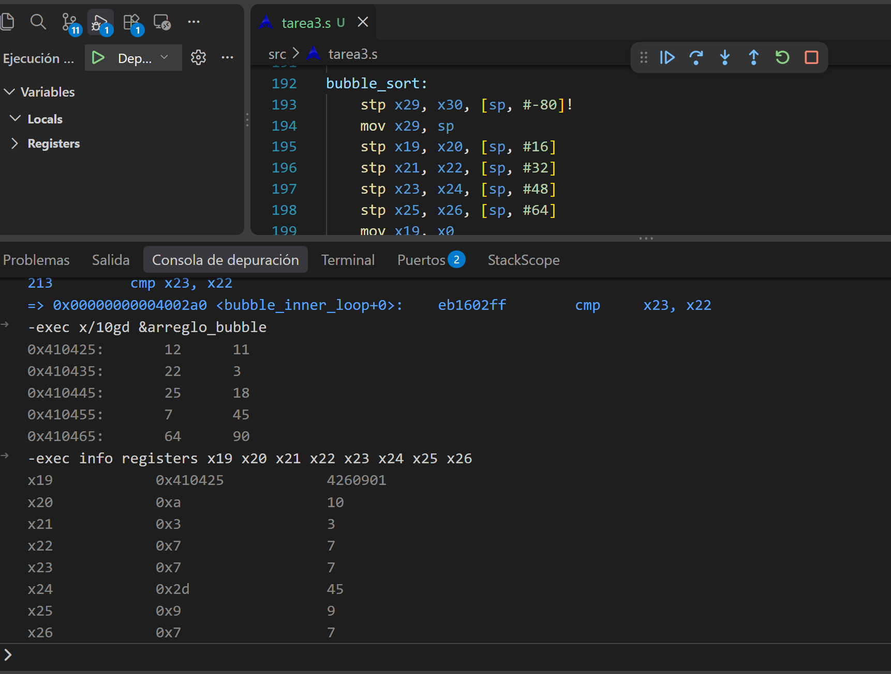
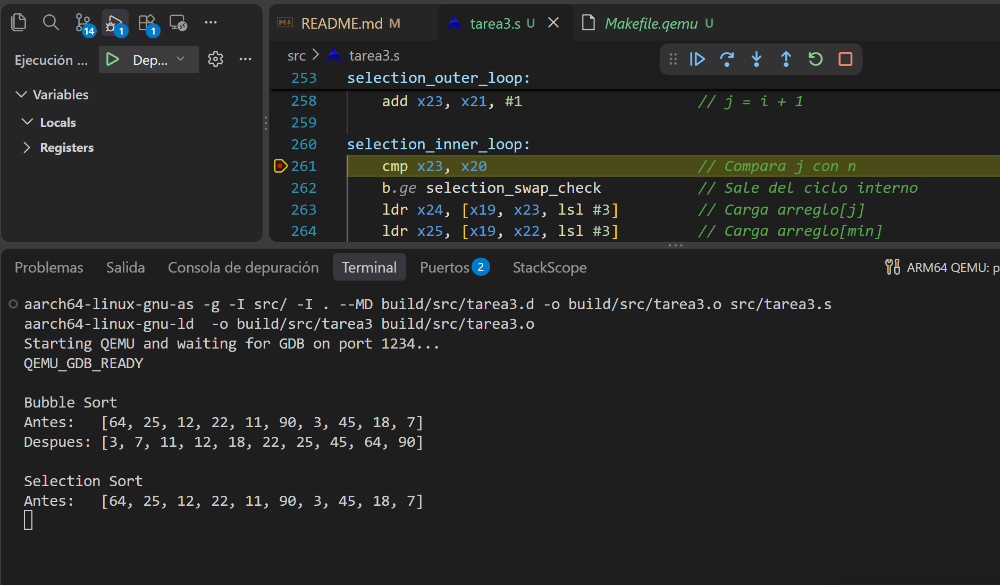
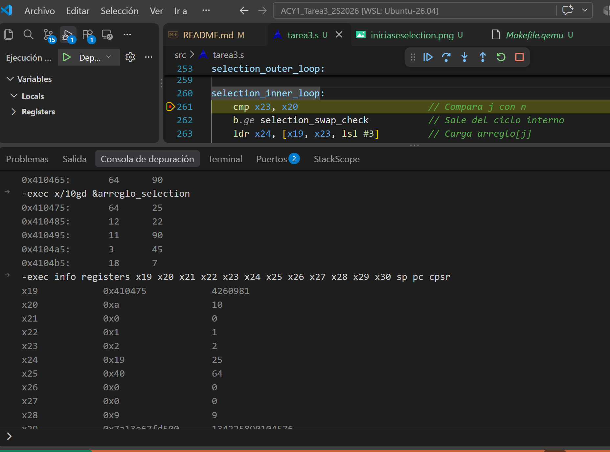
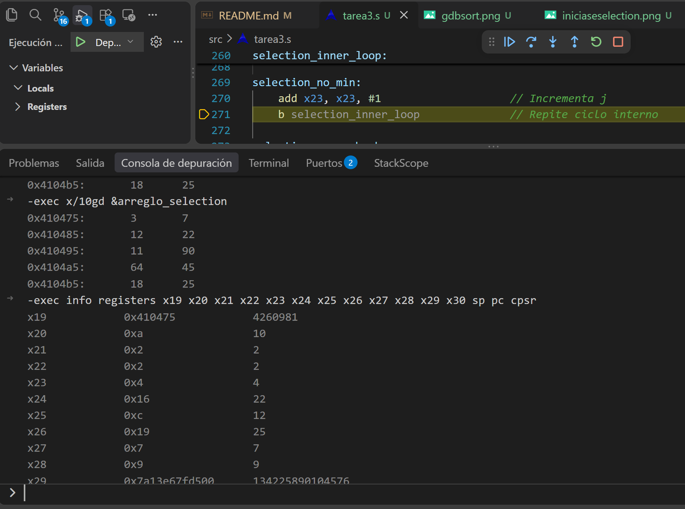
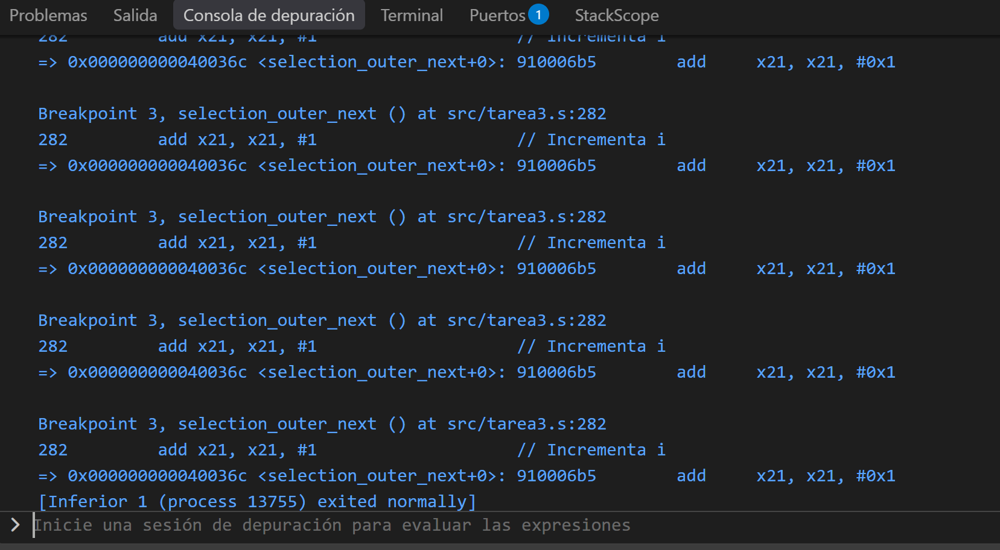

# ACY1 Tarea 3 - ARM64

## Descripción

Implementación de dos algoritmos de ordenamiento en lenguaje ensamblador ARM64:

- Bubble Sort
- Selection Sort

Ambos algoritmos ordenan arreglos de enteros de 64 bits almacenados en memoria. Las funciones reciben la dirección base del arreglo y el tamaño por registros, ordenan in-place y utilizan stack frame propio.

## Estructura del proyecto

```text
ACY1_Tarea3_2S2026/
├── src/
│   └── tarea3.s
├── screenshots/
│   ├── ejecucion.png
│   └── gdb_breakpoint.png
├── Makefile.qemu
└── README.md
```

## Requisitos

- Ubuntu / WSL
- `aarch64-linux-gnu-as`
- `aarch64-linux-gnu-ld`
- `qemu-aarch64`
- `gdb-multiarch`
- `make`

## Compilación y ejecución

Para ejecutar el programa:

```bash
make -f Makefile.qemu SRC=src/tarea3.s run
```

## Salida esperada

El programa imprime el arreglo antes y después de aplicar Bubble Sort y Selection Sort.

```text
Bubble Sort
Antes:   [64, 25, 12, 22, 11, 90, 3, 45, 18, 7]
Despues: [3, 7, 11, 12, 18, 22, 25, 45, 64, 90]

Selection Sort
Antes:   [64, 25, 12, 22, 11, 90, 3, 45, 18, 7]
Despues: [3, 7, 11, 12, 18, 22, 25, 45, 64, 90]
```



## Depuración con GDB

Para iniciar la sesión de depuración:

```bash
make -f Makefile.qemu SRC=src/tarea3.s gdb-vscode
```

Se colocó un breakpoint dentro del ciclo interno de Bubble Sort:

```asm
bubble_inner_loop:
```

Comandos usados en la consola de depuración:

```gdb
-exec info registers x19 x20 x21 x22 x23 x24 x25 x26
-exec x/10gd &arreglo_bubble
```

La captura muestra el programa detenido dentro del ciclo de ordenamiento, los registros principales y el contenido del arreglo en memoria.

# GDB Bubble Sort


---

---


---

# GDB Selection Sort


---


---


---


---


## Funciones implementadas

### Bubble Sort

Función:

```asm
bubble_sort
```

Recibe:

- `x0`: dirección base del arreglo
- `x1`: tamaño del arreglo

Ordena el arreglo usando ciclos anidados e intercambio de elementos adyacentes.

### Selection Sort

Función:

```asm
selection_sort
```

Recibe:

- `x0`: dirección base del arreglo
- `x1`: tamaño del arreglo

Ordena el arreglo buscando el menor elemento en cada iteración y colocándolo en su posición correspondiente.

## Uso de registros y stack

Las funciones principales utilizan stack frame propio y preservan los registros necesarios mediante instrucciones `stp` y `ldp`.

Ejemplo:

```asm
stp x29, x30, [sp, #-80]!
mov x29, sp
```

Esto permite guardar el frame pointer y el link register antes de ejecutar la función, y restaurarlos antes de retornar.

